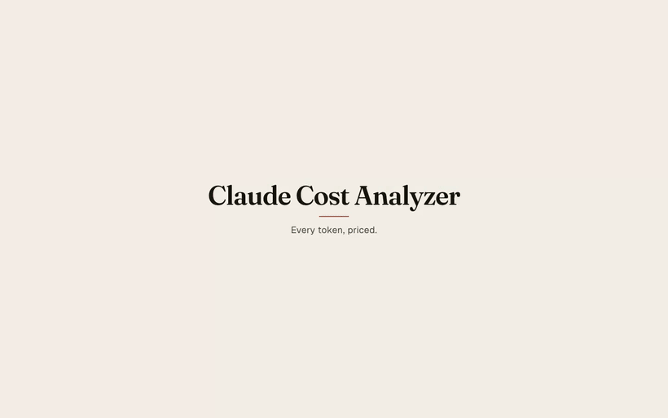

# Claude Cost Analyzer

A local, single-user web app that reads Claude Code transcripts from `~/.claude/projects` and
prices every conversation, turn, tool call, subagent, workflow, hook and harness injection at API
list prices.



Full narrated tour: [`docs/demo/demo.mp4`](docs/demo/demo.mp4) (GitHub plays it in the file
viewer) · hero screenshot: [`docs/screenshots/hero-overview.paper.png`](docs/screenshots/hero-overview.paper.png).
Every image and the video above are the app's own bundled synthetic demo dataset (`npm run demo`)
— none of it is a real conversation.

## Why

When Claude usage moves from a flat subscription to pay-per-token billing, the question becomes
what each conversation actually costs — and every transcript already holds the exact token
counts each request billed. This app turns those counts into
dollars at public list prices, so you can see and shape your spend before the switch — by model,
by project, by tool, by hook — without sending a single transcript line anywhere. Nothing leaves
the machine: no network calls at runtime, no telemetry, server bound to `127.0.0.1` only.

## Requirements

- **Node 22** (`>=22.13 <23`, or **Node 24+**). `node:sqlite` is the app's only database driver and
  the index needs FTS5 with the trigram tokenizer; Node 23's bundled SQLite build lacks FTS5, so
  the app refuses to start on it. `.nvmrc` pins `22` — run `nvm use` before anything else.

## Quick start

```sh
nvm use
npm install
npm run build
npm start
```

Opens `http://127.0.0.1:4141` (macOS auto-opens a browser tab). The first index of a few hundred
sessions takes seconds; a status pill in the top bar shows progress while it runs.

### Embed in another local dashboard

To show The Ledger inside another loopback app (for example a productivity dashboard on port 3000),
start the server with parent origins allow-listed and add an iframe tab pointing at this app:

```sh
CCA_EMBED_ORIGINS=http://127.0.0.1:3000,http://localhost:3000 npm start -- --no-open
```

In the host app's config:

```json
{
  "externalTabs": [
    { "label": "Cost Analyzer", "url": "http://127.0.0.1:4141", "mode": "iframe" }
  ]
}
```

Only CSP `frame-ancestors` is relaxed; the server still binds `127.0.0.1` only and does not
emit CORS headers. Non-loopback parent origins are ignored.

Open the host dashboard at `http://127.0.0.1:3000` (not `localhost`) so the iframe can set its
session cookie — `localhost` and `127.0.0.1` are different sites to the browser.

### Try it with synthetic data

```sh
npm run demo
# or, against the already-built server:
node dist/server/cli.js --demo
```

This generates a fictional dataset (invented projects, prompts, tools and hook names — nothing
from a real machine) and serves it instead of your own transcripts. Nothing under `~/.claude` is
read or written in demo mode: the generated tree and its own index/config live under
`<CCA_HOME>/demo/` (or `--out` for `npm run demo`), entirely separate from your real data.

## What you see

- **Overview** — range KPIs, spend by model/project, daily spend, category split, top sessions,
  plan-vs-pay-per-token gauge, budget forecast, top insights.
- **Sessions** — project tree plus a session list, sortable by cost, duration, recency.
- **Session detail** — tabs for Summary (receipt, cost waterfall, facts), Transcript (turn by
  turn, tool calls, thinking), Tools, Agents (subagent tree), Hooks & Harness, Timeline.
- **Search** — title or full-text search across every transcript, with snippets and filters.
- **Analytics** — Tools, Models, Hooks, Attribution (skills/plugins/MCP servers), each with a
  "show as table" toggle.
- **Insights** — ranked findings with a dollar impact: expensive tool results, compactions,
  cold-cache requests, Fable/Opus mix, and more.
- **Compare** — two sessions side by side.
- **Settings** — pricing table editor, plan/budget config, transcript roots, theme, data
  management (reindex, rebuild).
- **Methodology** — the plain-language version of the next section.

Keyboard: `⌘K` command palette, `?` shortcut sheet, `g`-prefixed navigation (`g o` Overview, `g s`
Sessions, `g c` Compare, …), `j`/`k` between rows, `Enter` to open, `[`/`]` to step turns. Light
and dark themes. CSV/JSON export and a "copy as Markdown" session receipt on every page that has
a table. An empty index shows a first-run panel naming the roots it looked in, with everything
else that works with nothing indexed (Settings, Methodology) still rendering normally.

## How costs are computed

Every number on screen is labelled **exact** or **estimated ("est.")**. Exact numbers come
straight from the token counts Claude Code writes into each transcript line and the public list
price for that model — request cost, session cost, per-model cost, the cache read/write split.
Estimated numbers allocate a request's exact cost across the tool calls, hooks and injections that
filled its context window, because Anthropic bills per request, not per tool call — so any
per-tool number is necessarily an attribution model, documented in full so you can judge it.

Where a session carries Claude Code's own running cost tally (`cost-state` lines), the session
page shows it next to the computed total and labels the pair with one of several statuses
(`match`, `tally-includes-earlier-process`, `file-covers-more-than-tally`, `hidden-calls-only`,
`mixed`) rather than a pass/fail — a resumed, forked or continued session can start that counter
already holding a parent's total, or reset it, while the transcript keeps the whole history, so
the two numbers don't always measure the same span of a conversation.

See [`docs/METHODOLOGY.md`](docs/METHODOLOGY.md) for the full model and formulas.

## Configuration

CLI flags (`node dist/server/cli.js [flags]`; `npm start -- [flags]` to pass them through):

| flag | default | what it does |
|---|---|---|
| `--port <n>` | `4141` | port to bind (`127.0.0.1` only, not configurable) |
| `--no-open` | off | don't auto-open a browser |
| `--claude-dir <path>` | — | transcript root to index, overriding configured roots |
| `--home <path>` | — | overrides `CCA_HOME` |
| `--reindex` | off | one-shot full rebuild; prints counts and exits without starting the server |
| `--demo` | off | serve the synthetic demo dataset instead of `--claude-dir`/configured roots |
| `--seed <n>` | — | demo mode: seeds the generator (same seed → identical dataset) |
| `--sessions <n>` | — | demo mode: how many sessions to generate (5–400) |

Environment variables:

| variable | default | what it does |
|---|---|---|
| `CCA_HOME` | `~/.claude-cost-analyzer` | where `index.sqlite` and `config.json` live |
| `CCA_PORT` | `4141` | default port; `--port` overrides it |
| `CCA_CLAUDE_DIR` | — | transcript root, overriding `settings.roots`; `--claude-dir` overrides both |

`config.json` (pricing table, plan/budget, transcript roots, theme) and `index.sqlite` (the
searchable index) live under `CCA_HOME`. The pricing table is editable from Settings — a what-if
swap or an edited price is read live from `config.json`; nothing is re-indexed to price by a
different table, because money is computed at read time from stored token counts.

## Privacy & security

Everything stays on the machine: no network calls at runtime, the server binds `127.0.0.1` only,
and no CORS headers are ever emitted. Every `/api/*` route requires an origin-bound session
cookie, issued fresh per process and checked against `Host`/`Origin` to resist cross-site and
DNS-rebinding access. No telemetry, no external fonts or scripts — every font is bundled. The
index is a rebuildable cache keyed by a schema version: delete it, or use Settings › Data ›
rebuild, and it comes back from your transcripts with no data loss. `CCA_HOME`'s directory and
files are locked to `0700`/`0600`. Transcripts are only ever read, never copied or modified.
Contributors can run `npm run check:privacy` to check that nothing real (names, real paths, real
prompts) has crept into the repository.

## Development

```sh
npm run dev          # server (127.0.0.1:4141) + Vite (127.0.0.1:5173, proxies /api)
npm run build         # tsc + vite build → dist/
npm test              # vitest unit tests, against fakes/fixtures — never a real DB
npm run test:e2e      # builds, then Playwright + axe against tests/fixtures/projects
                       # (CCA_E2E_PORT / CCA_E2E_HOME override the port/home it uses)
npm run typecheck     # tsc across node, web and tests configs
npm run screenshot    # every page, both themes, into docs/screenshots/ (needs a running, indexed server)
npm run demo:data     # generate the synthetic dataset only, without serving it
npm run demo:video    # record the narrated screen tour into docs/demo/
npm run check:privacy # scans the repo for real names/paths/prompts that shouldn't be here
```

Node 22 is required for everything above except pure static checks. `npx tsx` can hang in a
sandboxed shell (it opens a socket to its child process); run TypeScript one-offs with
`node --import tsx/esm <file>.ts` instead.

Per-module notes live in `docs/dev/`: `parse.md`, `cost-db.md`, `server.md`, `web.md`,
`integration.md`, `validation.md`, `demo.md`, `demo-video.md`. Start with `docs/dev/README.md`.

## Project layout

```
core/       pure TypeScript domain logic: parsing, pricing, cost/attribution, SQLite index
server/     Hono HTTP app, CLI, indexing worker, filesystem watcher
web/        Vite + React 19 UI ("The Ledger")
scripts/    dev orchestration, demo data/video generation, cost-state validation, screenshots
tests/      vitest unit tests, synthetic fixtures, Playwright e2e
docs/       this documentation, methodology, screenshots, the demo video/gif
```

## Troubleshooting

- **"This Node build's SQLite has no FTS5"** — you're on the wrong Node. Run `nvm use` (`.nvmrc`
  pins 22) and restart.
- **Port in use** — pick another with `--port` (or `CCA_PORT`); the default is `4141`.
- **A page telling you to run `npm run build`** — `dist/web` doesn't exist yet (fresh checkout, or
  `npm start` before a build). Run `npm run build` and restart.
- **Stale-looking data after upgrading** — the index schema may have changed; a `PRAGMA
  user_version` mismatch drops and rebuilds every table automatically on next start, so this is
  usually silent. If something still looks wrong, force it with `--reindex` or Settings › Data ›
  rebuild.
- **The watcher isn't picking up new sessions on Linux** — recursive `fs.watch` isn't reliable
  outside macOS/Windows; use Settings › Data to trigger a manual reindex, or restart the server.
- **The demo video sounds robotic** — it's narrated with macOS `say` using whatever voice is
  installed; install a Premium voice (System Settings › Accessibility › Spoken Content) for a
  better one and pass `--voice` to `npm run demo:video`.

## Contributing

Issues and pull requests are welcome. See [`CONTRIBUTING.md`](CONTRIBUTING.md) for setup, the
command reference, and the codebase conventions. Before opening a PR, run `npm run typecheck`,
`npm test`, and (if you touched `web/**`, `core/**`, or anything the built server serves)
`npm run test:e2e`. Fixtures under `tests/fixtures` must stay synthetic — never commit a real
transcript, and run `npm run check:privacy` if you're unsure.

## License

[MIT](LICENSE).
